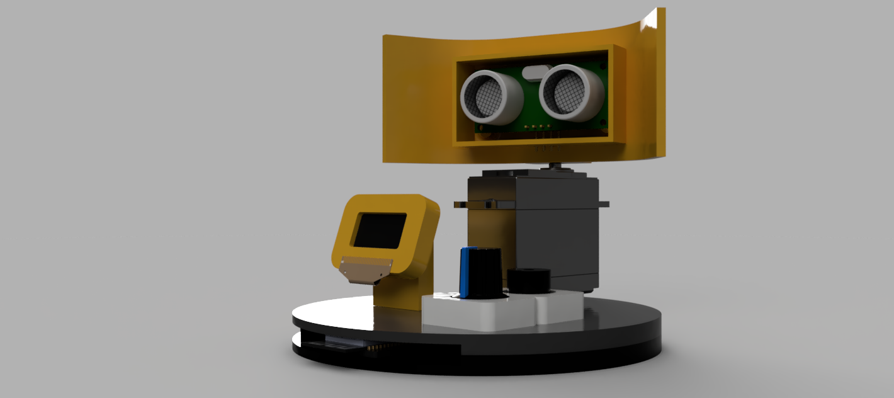
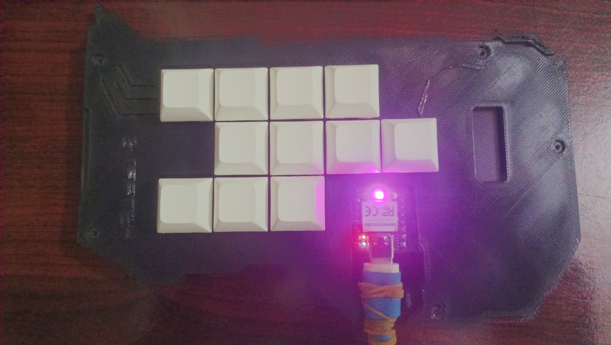
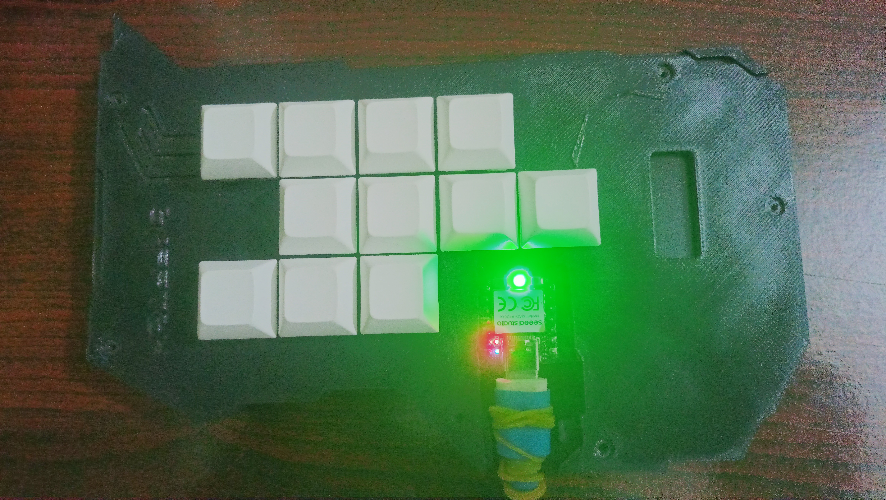
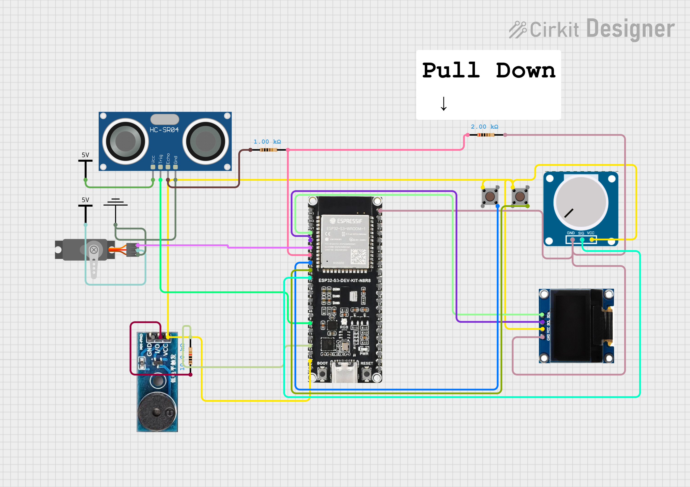
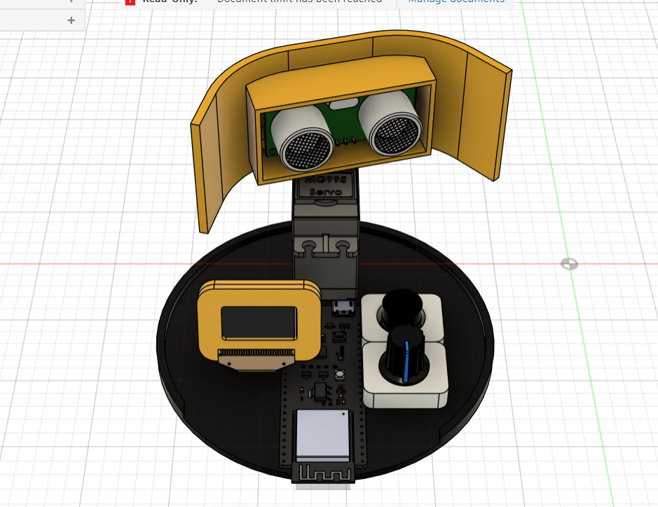

# Arcade-Range-Finder

## What this project do?
Arcade-Range-Finder is a ESP32 S3 based range finder which uses Ultrasonic sensor and oled display to show the range in a very unique way.
This project has three modes controlled by pushButtons. 
Mode 1 & 2: Radar like display which shows Blits when an object is detected in range.
Mode 1 Specific - Manual Cntrol servo with Potentiometer.
Mode 2 Specific - Servo runs in loop.

Mode 3: Servo runs on loop.  But in oled everytime the range changes, new ball is displayed and most prior ball gets removed from the screen. And every ball's speed is determined by the mapped distance to the speed of ball.
We also have small box which copies the x-cordinates of ball so everytime ball touches the box the ball gets bounced back.

## Why I made this ?

I have seen multiple range finder but almost all of them had radar like display, but I wanted to do something different and unique.

## Wiring:

### This project doesnt uses pcb so its a simple wiring diagram .

Note (important): Do not power servos and ultrasonic sensor with MCU.

## Cad:

## Bill of Materials (BOM)

| S No | Item | Unit | Price (Rs) | Price ($) | Link |
|------|------|------|------------|-----------|------|
| 1 | WaveShare Esp32 MicroController | 1 | 911 | 9.86 | https://robu.in/product/waveshare-esp32-s3-microcontroller-2-4-ghz-wi-fi-development-board-dual-core-processor-with-frequency-up-to-240-mhz/ |
| 2 | MG995 Servo | 1 | 240 | 2.60 | https://robu.in/product/towerpro-mg995-metal-gear-servo-motor/ |
| 3 | HC-SR04 Ultrasonic Sensor | 1 | 76 | 0.82 | https://robocraze.com/products/hc-sr-04-ultrasonic-sensor |
| 4 | SSD1306 0.96 OLED 128x64 | 1 | 219 | 2.37 | https://robu.in/product/0-96-oled-display-module/ |
| 5 | 4-Pin Tactile | 2 | 24 | 0.26 | [link](https://robocraze.com/products/tactile-12x12x8mm-4-pin-push-button-switch-pack-of-5?_pos=1&_sid=b55f31e74&_ss=r) |
| 6 | Buzzer Module | 1 | 24 | 0.26 | https://robu.in/product/smartelex-passive-buzzer-module/ |
| 7 | 10k Ohm 0.25W Resistor | 100 pcs | 98 | 1.06 | https://robu.in/product/10k-ohm-0-5w-metal-film-resistor-pack-of-50/ |
| 8 | Breadboard | 1 | 61 | 0.66 | https://robu.in/product/mb102-830-points-solderless-prototype-pcb-breadboard-high-quality/ |
| 9 | Jumper Wire Set | 1 | 128 | 1.39 | https://robocraze.com/products/jumper-wire-set-m2m-m2f-f2f-40-pcs-each?variant=40192573636761 |
| 10 | 10k Rotary Potentiometer | 5 pcs | 66 | 0.71 | https://robocraze.com/products/10k-ohm-16mm-rotatory-variable-potentiometer-pack-of-5 |
| 11 | Header Pins | 3 | 18 | 0.19 | https://robocraze.com/products/40x1-pin-2-54mm-pitch-male-berg-strip?_pos=3&_sid=467fd7cec&_ss=r |
| 12 | Shipping (Robocraze) | | 49 | 0.53 | - |
| 13 | Shipping (Robu.in) | | 0 | 0.00 | - |
| | **Total** | | **1914** | **20.71** | - |
Note: I have not inlcuded breadboard in the cad because it was not part of the final product.
But I really need one.

## Navigation (Directory)

[Assets](./Assets/)  
[Body](./Body/)  
[Cad-Assembly](./Cad-Assembly/)  
[firmware](./firmware/)  
[Production](./Production/)  

thanks to :
  Blueprint and Hackclub!

